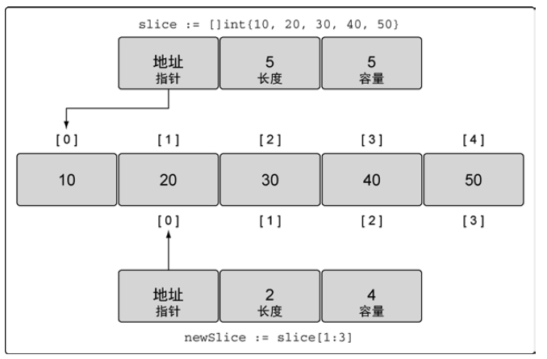
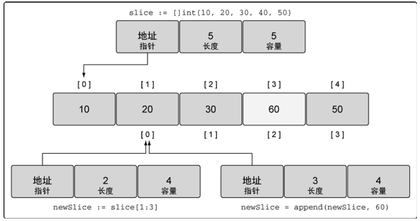
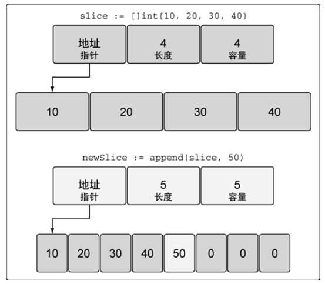
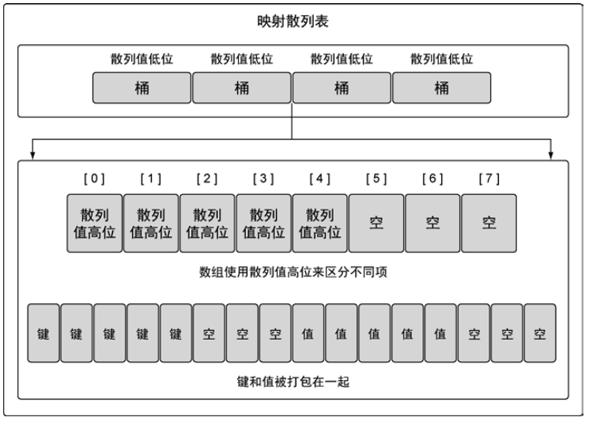

# 第4章 数组、切片和映射

## 4.1 数组的内部实现和基础功能

### 4.1.1 内部实现

长度固定的数据类型，用于存储一段具有相同类型的元素的连续块。

存储类型可以是内置类型，也可以是某种结构类型。

### 4.1.2 声明和初始化

```go
var array [5]int //声明
```

**Go语言中声明变量时，总会使用对应类型的零值对变量进行初始化**

```go
array:=[5]int{1,2,3,4,5}
array:=[...]int{1,2,3,4,5,6} //容量由初始化值的数量决定
array:=[5]int{1:10,2:20} //声明一个长度为5的数组，用具体值初始化索引为1和2的元素，其余元素保持零值
```

### 4.1.3 使用数组

Go语言中，数组是一个值，变量名代表数组全体，同样类型的数组可以赋值给另一个数组，复制后，两个数组的值完全相同，且修改其中一个数组中的元素，不会影响到另一个数组。

相同类型的数组：数组长度和每个元素的类型均一致的数组。

### 4.1.5 在函数间传递数组

Go函数的参数的传递方式为值传递，如果将一个数组传递给函数，会新建一个数组。

一般通过指针传递数组，但是要注意，函数内对数组的操作会修改原数组。

## 4.2 切片的内部实现和基础功能

围绕**动态数组**概念构建的数据结构。

可按需自动增长和缩小。

切片的底层是一个数组，也是在连续块中分配的。

### 4.2.1 内部实现

切片对底层数组进行抽象，并提供相关的操作方法。

切片是有三个字段的数据结构：

* 指向底层数组的指针
* 切片访问的元素个数（长度）
* 切片允许增长到的元素个数（容量）

### 4.2.2 创建和初始化

是否能提前知道切片的容量通常决定如何创建切片。

#### make和切片字面量

```go
// make
slice:=make([]string,5)//创建一个字符串切片，其长度和容量都是5
slice:=make([]int,3,5)// 创建一个整型切片，其长度为3，容量为5

// 字面量
slice:=[]string{"aa","bb"}  //长度和容量均为2
slice:=[]int{10,20,30}     //长度和容量均为3
slice:=[]string{99:""}   //通过字面量创建一个长度为100的切片
```

#### nil和空切片

声明时不做任何初始化，就会创建一个nil切片

```go
var slice []int  //长度为0，容量为0
```

当函数要求返回一个切片，但是发生异常时，返回nil切片是一个很好的选择。

空切片

```go
// 空切片，长度为0，容量为0
slice:=make([]int,0)
slice:=[]int{}
```

### 4.2.3 使用切片

#### 1.赋值和切片

```go
slice:=[]int{1,2,3,4,5}
slice[1]=25 //赋值

newSlice:=slice[1:3] //取slice切片中索引为[1,3)的元素构成一个新切片，长度为2，容量为4，与slice共享底层数组
```



计算长度和容量

> 对底层数组容量是k的切片slice[i:j]
>
> 长度=j-i
>
> 容量=k-i

两切片共享同一个底层数组，一个切片的修改行为会被另一个切片感知。

#### 2.切片增长

append函数用于向切片中追加新的元素，并返回追加元素后的切片。

append函数会处理增加长度时的所有操作细节。

append函数总是会增加新切片长度，容量是否变化取决于被操作切片的可用容量。

```go
slice:=[]int{10,20,30,40,50}
newSlice:=slice[1:3]

newSlice=append(newSlice,60)
```



因为 newSlice 在底层数组里还有额外的容量可用，`append`操作将可用的元素合并到切片的长度，并对其进行赋值。由于和原始的`slice`共享同一个底层数组，`slice`中**索引为 3 的元素的值也被改动了**。

如果切片的底层数组没有足够的可用容量，`append`函数会创建一个新的底层数组，将被引用的现有的值复制到新数组里，再追加新的值。



切片容量小于1000时，以2倍扩容，超过1000时，以1.25倍扩容。

#### 3.创建切片时的3个索引

```go
source:=[]string{"apple","orange","plum","banana","grape"}
slice:=source[2:3:4]
```

* 第一个索引表示起始位置
* 第二个索引表示终止位置（前一个）
* 第三个索引表示容量终止位置（前一个）

计算公式

```
对于slice[i:j:k]
元素范围：[i,j)
长度：j-i
容量：k-i
```

如果试图设置的容量比可用的容量还大，就会得到一个语言运行时错误。

如果在创建切片时设置切片的容量和长度一样，就可以强制让新切片的第一个 append 操作创建新的底层数组与原有的底层数组分离。新切片与原有的底层数组分离后，可以安全地进行后续修改。

```go
source:=[]string{"apple","orange","plum","banana","grape"}
slice:=source[2:3:3]
slice=append(slice,"kiwi") // 底层数组与原数组脱离
```

#### 4.迭代切片

采用range关键字迭代切片

```go
source:=[]string{"apple","orange","plum","banana","grape"}
for index,value:=range source{
  //.....
}
```

range创建了每个元素的副本，而不是直接返回对该元素的引用。

对于切片：

* `len()`函数返回切片长度
* `cap()`函数返回切片容量

## 4.3 映射的内部实现和基础功能

### 4.3.1 内部实现

无序集合，底层为散列表。

内部结构简单表示：



键的低位被用于选择桶，每个桶对应一个数组，用于存储对应键的高8位。

随后，一个字节数组用于存储键值对，先依次存储该桶中所有的键，之后依次存储桶中所有的值。

### 4.3.2 创建和初始化

```go
dict:=make(map[string]int) //key:string value:int

dict:=map[string]string{"Red":"#da1337","Orange":"#e95a22"}
```

映射的键可以是任何值，这个值的类型可以是内置的类型，也可以是结构类型，**只要这个值可以使用==运算符做比较**

**切片、函数以及包含切片的结构类型这些类型由于具有引用语义， 不能作为映射的键**，使用这些类型会造成编译错误。

### 4.3.3 使用映射

```go
var colors map[string]string. //通过声明映射创建一个nil映射
```

对nil映射进行赋值会报错。

判断映射中是否存在某个键：

```go
value,exist:=colors["Blue"]
// 如果存在
if exist{
  //....
}
```

在 Go 语言里，通过键来索引映射时，即便这个键不存在也总会返回一个值。在这种情况下， 返回的是该值对应的类型的零值。

遍历映射：

```go
for key,value:=range colors{
  //...
}
```

删除映射

```go
delete(colors,"Coral")//删除键为Coral的键值对
```

