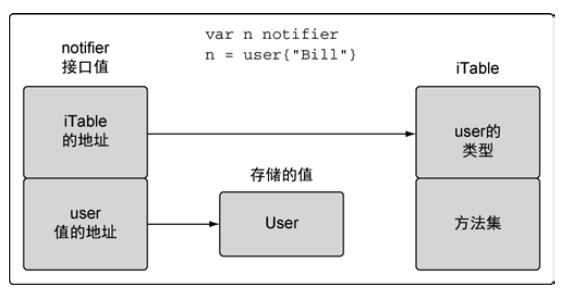

# 第5章 Go语言类型系统

## 5.1 用户定义的类型

```go
type user struct{
  name string
  email string
  ext int
  privileged bool
}

var bill user //声明user类型的变量
```

声明变量时，变量的值会被初始化为0值。对于结构体，每个字段都会用0值初始化。

创建变量

```go
// 方式1，对字段顺序无要求
lisa:=user{
  name:"Lisa",
  email:"lisa@email.com",
  ext:123,
  privileged:true,
}
// 方式2，必须按照定义的字段顺序赋值
lisa:=user{"Lisa","lisa@email.com",123,true}
```

## 5.2 方法

方法能给用户定义的类型添加新的行为

```go
package main

import "fmt"

type user struct {
	name  string
	email string
}
// 使用一个值接收者实现方法
func (u user) notify() {
	fmt.Printf("Sending User Email To %s<%s>\n",
		u.name,
		u.email)
}

// 使用一个指针接收者实现方法
func (u *user) changeEmail(email string) {
	u.email = email
}

func main() {
	// 值
	bill := user{"Bill", "bill@email.com"}
	bill.notify()

	// 指针
	lisa := &user{"Lisa", "lisa@email.com"}
	lisa.notify()

	bill.changeEmail("bill@newdomain.com")
	bill.notify()

	lisa.changeEmail("lisa@newdomain.com")
	lisa.notify()
}
```

#### 分析

Go语言中存在***值接收者***和***指针接收者***

* 使用值接收者声明方法，调用时会使用这个值的一个副本来执行
* 使用指针接收者声明方法，调用时会使用指针指向的实际值来执行

```go
lisa.notify()
// 等价于
(*lisa).notify()
```

首先进行解引用操作，随后进行值拷贝操作，调用`notify()`方法。

```go
bill.changeEmail("bill@newdomain.com")
//等价于
(&bill).changeEmail("bill@newdomain.com")
```

首先进行取指针操作，随后进行指针拷贝操作。

Go 语言既允许使用值，也允许使用指针来调用方法，不必严格符合接收者的类型。

## 5.3 类型的本质

如 果是要创建一个新值，该类型的方法就使用值接收者。如果是要修改当前值，就使用指针接收者。

> 不要只关注某个方法是如何处理这个值，而是要关注这个值的本质是什么。

### 5.3.1 内置类型

原始的类型。当对这些值进行增加或者删除的时候，会**创建一个新值**。

基于这个结论，当把这些类型的值传递给方法或者函数时，应该传递一个对应值的副本。

### 5.3.2 引用类型

引用类型：切片(slice)、映射(map)、通道(channel)、接口(interface)和函数(func)

当声明上述类型的变量时，创建的变量被称作标头(header)值。

每个引用类型还包含一组独特的字段，用于管理底层数据结构。

因为标头值是为复制而设计的，所以永远不需要共享一个引用类型的值。标头值里包含一个指针，因此通过复制来传递一个引用类型的值的副本，本质上就是在共享底层数据结构。

### 5.3.3 结构类型

如果决定在某些东西需要删除或者添加某个结构类型的值时该结构类型的值不应该被更改，那么需要遵守内置类型和引用类型的规范。

## 5.4 接口

### 5.4.2 实现

对接口值方法的调用会执行接口值里存储的用户定义的类型的值对应的方法。

因为任何用户定义的类型都可以实现任何接口，所以对接口值方法的调用是一种多态。

在这个关系里，用户定义的类型通常叫作**实体类型**，原因是如果离开内部存储的用户定义的类型的值的实现，接口值并没有具体的行为。

接口值是一个两个字长度的数据结构：

* 第一个字包含一个指向iTable的指针
  * iTable包含了已存储的值的类型信息以及与这个值相关联的一组方法
* 第二个字是一个指向所存储值的指针



### 5.4.3 方法集

